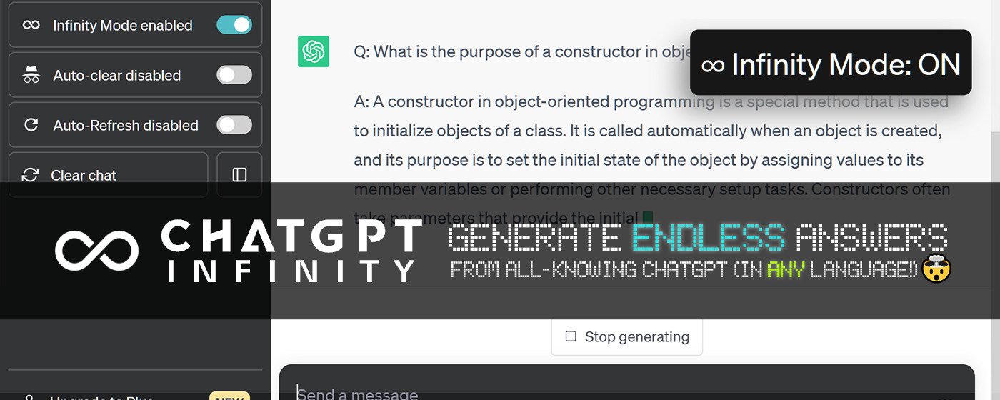

    <h6>
        <picture>
            <source type="image/svg+xml" media="(prefers-color-scheme: dark)" srcset="https://raw.githubusercontent.com/KudoAI/chatgpt.js/main/media/images/icons/earth-americas-white-icon32.svg">
            
        </picture>
        &nbsp;简体中文 |
        <a href="../..#readme">English</a>
    </h6>

 

## 💡 关于

**ChatGPT 无限** 是您的终极聊天伴侣：一个免费（但功能强大）的附加组件，使 ChatGPT 在*任何*主题上生成无限答案！

## 💊 好处

🧠 **可自定义主题选择** — 通过选择您希望 ChatGPT 生成答案的特定主题来控制您的学习

🌍 **多语言支持** — 为回复选择任何回复语言

⏱️ **可调整的响应间隔** — 通过调整响应间隔来调整 ChatGPT 的回复速度以符合您所需的速度

📜 **自动滚动** — 通过自动滚动功能享受无缝聊天体验，确保您不会错过任何一个回复

## 🚀 如何安装

###  Greasemonkey 用户脚本:

1. 安装 ChatGPT 无限 扩展程序 ([Chrome](https://chrome.chatgptinfinity.com), [Edge](https://edge.chatgptinfinity.com))

2. 正常访问 [chat.openai.com](https://chat.openai.com) & 侧边栏添加无限切换!

*专业提示：更轻松地访问扩展开关, (1) 点击  在浏览器的工具栏中, (2) 然后  扩展名旁边.*

###  Greasemonkey 用户脚本:

1. 安装 Tampermonkey ([Chrome](https://chrome.google.com/webstore/detail/tampermonkey/dhdgffkkebhmkfjojejmpbldmpobfkfo), [Firefox](https://addons.mozilla.org/firefox/addon/tampermonkey/), [Edge](https://microsoftedge.microsoft.com/addons/detail/tampermonkey/iikmkjmpaadaobahmlepeloendndfphd), [Opera](https://addons.opera.com/extensions/details/tampermonkey-beta/)) 或者 Violentmonkey ([Chrome](https://chrome.google.com/webstore/detail/violent-monkey/jinjaccalgkegednnccohejagnlnfdag), [Firefox](https://addons.mozilla.org/firefox/addon/violentmonkey/), [Edge](https://microsoftedge.microsoft.com/addons/detail/violentmonkey/eeagobfjdenkkddmbclomhiblgggliao))

2. 安装 [ChatGPT 无穷](https://greasyfork.chatgptinfinity.com) 用户脚本 (将加载上面安装的用户脚本管理器)

3. 访问 [chat.openai.com](https://chat.openai.com) & 侧边栏添加无限切换!

*注意：可以通过单击用户脚本管理器的工具栏图标来访问其他设置*

## ⚡ 依赖关系

<h6>

 

<a href="https://chatgpt.js.org/#/zh-cn/">
    <picture>
        <source type="image/png" media="(prefers-color-scheme: dark)" srcset="https://raw.githubusercontent.com/KudoAI/chatgpt.js/main/media/images/chatgpt.js-logo-dark-mode-5995x619.png">
        
    </picture>
</a>
  

ChatGPT 无穷 依赖于强大的 [chatgpt.js](https://github.com/KudoAI/chatgpt.js) 库 © 2023–2024 KudoAI 和贡献者在 MIT 许可下的代码。

</h6>

## 🌐 兼容性

ChatGPT 无穷 与以下浏览器兼容.

### 台式:

- **[Google Chrome](https://www.chrome.com)** (通过 [Chrome 扩大](https://chrome.chatgptinfinity.com) or [Greasemonkey 用户脚本](https://greasyfork.chatgptinfinity.com))
- **[Mozilla Firefox](https://www.firefox.com)** (通过 [Greasemonkey userscript](https://greasyfork.chatgptinfinity.com))
- **[Microsoft Edge](https://www.microsoft.com/edge)** (通过 [Edge 扩大](https://edge.chatgptinfinity.com) or [Greasemonkey 用户脚本](https://greasyfork.chatgptinfinity.com))
- **[Opera](https://www.opera.com)** (通过 [Chrome 扩大](https://chrome.chatgptinfinity.com) or [Greasemonkey 用户脚本](https://greasyfork.chatgptinfinity.com))
- **[Brave](https://brave.com)** (通过 [Chrome 扩大](https://chrome.chatgptinfinity.com) or [Greasemonkey 用户脚本](https://greasyfork.chatgptinfinity.com))
- **[Vivaldi](https://vivaldi.com)** (通过 [Chrome 扩大](https://chrome.chatgptinfinity.com) or [Greasemonkey 用户脚本](https://greasyfork.chatgptinfinity.com))
- **[LibreWolf](https://librewolf.net/)** (通过 [Greasemonkey 用户脚本](https://greasyfork.chatgptinfinity.com))
- **[Ghost](https://ghostbrowser.com/)** (通过 [Chrome 扩大](https://chrome.chatgptinfinity.com) or [Greasemonkey 用户脚本](https://greasyfork.chatgptinfinity.com))
- **[QQ](https://browser.qq.com/)** (通过 [Chrome 扩大](https://chrome.chatgptinfinity.com) or [Greasemonkey 用户脚本](https://greasyfork.chatgptinfinity.com))
- **[Whale](https://whale.naver.com/)** (通过 [Chrome 扩大](https://chrome.chatgptinfinity.com) or [Greasemonkey 用户脚本](https://greasyfork.chatgptinfinity.com))

### 安卓:

- **[Kiwi](https://kiwibrowser.com/)** (通过 [Chrome 扩大](https://chrome.chatgptinfinity.com) or [Greasemonkey 用户脚本](https://greasyfork.chatgptinfinity.com))
- **[Mozilla Firefox](https://www.mozilla.org/firefox/browsers/mobile/android/)** (通过 [Greasemonkey userscript](https://greasyfork.chatgptinfinity.com))

 

[讨论](https://chatgptinfinity.com/discuss) / 
[更多 ChatGPT 附加组件](https://github.com/adamlui/chatgpt-apps)

## 🧠 贡献者

该项目的存在得益于以下贡献者的代码、翻译、问题和想法:

#

 

<a href="https://star-history.com/#adamlui/chatgpt-infinity">
    <picture>
        <source media="(prefers-color-scheme: dark)" srcset="https://api.star-history.com/svg?repos=adamlui/chatgpt-infinity&type=Timeline&theme=dark" />
        
    </picture>
</a>

 _如果这个仓库对您有帮助，请考虑给它 ⭐!_

## 🤖 更多 ChatGPT 应用

如需更多精彩的 ChatGPT 应用程序，请访问: https://github.com/adamlui/chatgpt-apps
  

## 📜 相关应用

### <picture><source media="(prefers-color-scheme: dark)" srcset="https://i.imgur.com/RduASbD.png"></picture> [ChatGPT 自动刷新 ↻](https://github.chatgptautorefresh.com) 

> 保持 ChatGPT 会话最新以消除网络错误 + Cloudflare 检查。
 [安装](https://github.chatgptautorefresh.com/tree/main/docs/zh-cn#-如何安装) / 
[自述文件](https://github.chatgptautorefresh.com/tree/main/docs/zh-cn#readme) / 
[讨论](https://chatgptautorefresh.com/discuss)

### <picture><source media="(prefers-color-scheme: dark)" srcset="https://i.imgur.com/RduASbD.png"></picture> [ChatGPT 自动继续 ⏩](https://github.chatgptautocontinue.com) 

> 自动继续生成多个 ChatGPT 响应。 
[安装](https://github.chatgptautocontinue.com/tree/main/docs/zh-cn#-如何安装) / 
[自述文件](https://github.chatgptautocontinue.com/tree/main/docs/zh-cn#readme) / 
[讨论](https://chatgptautocontinue.com/discuss)

###  [ChatGPT Widescreen Mode](https://github.chatgptwidescreen.com) 

> 向 ChatGPT 添加宽屏 + 全窗口模式以增强查看效果 + 减少滚动。
 [安装](https://github.chatgptwidescreen.com/tree/main/docs/zh-cn#-如何安装) / 
[自述文件](https://github.chatgptwidescreen.com/tree/main/docs/zh-cn#readme) / 
[讨论](https://chatgptwidescreen.com/discuss)

  
<a href="https://github.com/adamlui/chatgpt-apps">**更多 ChatGPT 附加组件**</a> / 
<a href="#">回到顶部 ↑</a>
