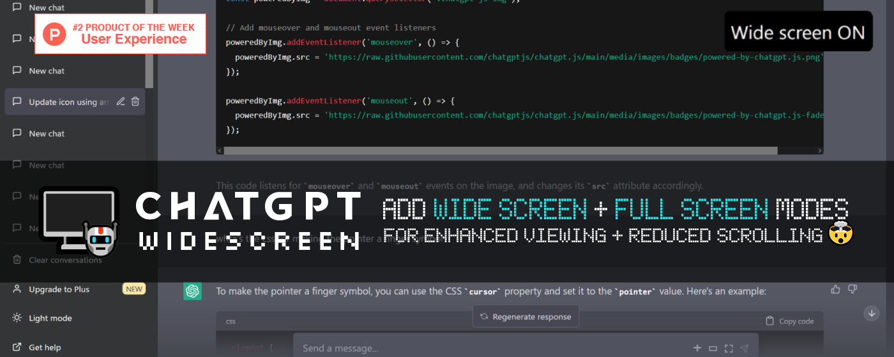

[![chatgptevo.com/widescreen](https://img.shields.io/static/v1?label=%20&message=https%3A%2F%2Fchatgptevo.com/widescreen&labelColor=464747&color=black&logo=data:image/png;base64,iVBORw0KGgoAAAANSUhEUgAAABUAAAAVCAYAAACpF6WWAAAAAXNSR0IB2cksfwAAAAlwSFlzAAALEwAACxMBAJqcGAAAAz9JREFUeJyNVUtIW1EQff4WggvRhfjbmEUjNo2LBIrQggsRWl0JIliKIC4E3YikSIWKEEQQwYXQgKCt4EIFUVF3ytMadCWklOIPUQRBE83PXz5veubhveTFRDpwue+9zD1z5szMjaKkse7u7nfb29s/jo6O/pycnATPzs4ip6en/uPjY8/W1tbE4eGhLd3ZZ9bT0/Nmf39ffXx81OjJZmdnqbGxkW5vbynRzs/PV/r6+kwvAi4vL38Kh8OGk3t7e5SVlUWdnZ20trZG8KH7+3tyu920tLREQRi+fUgJuLq6+vnh4SHGQEiZpqamqKGhgVpaWgg/G1ZGRoZ87ujoIBCJra+v1xkAh4aGrIgeRtqEdHRmyUCpVl5eHjU1NdHGxgaFQqHg9PR0hQSFNio+/BeQYNfW1kbDw8NSpmg0SijmjA44OTn5Hiw1ZpgOhJlnZ2fre2lpKUUiEYrFYqRpGsXjcQPwwsLCawXt8tPlcuk6DgwMGMAEkNAwNzeXHA4H3dzc0OjoKHV1dTE7PQAbBzk4OPimXF9f/2UwEdVsNkvAxABWq5W8Xq/0Y1a7u7u6BPwuGF9dXf1SAoFAaG5uTqawuLhoYCfSR3Up2VAcqq+vp9raWvL7/fo3dEJQQZNHx8bGpCPaTrJlYGbMOxg8A2XWvDY3N/UATxZXMCWB5uZmgzPrVFZWRpmZmZItZyO0S2UMzgYfn4KG/82Nnmg7OzuUn59vKFhhYSG1t7fT+Pi4BEg0Dsg6A09VkO7E3d2dwaG6ulrXMScnRy5RuPLy8pRMORimkkEdClrJLio3Pz9PBQUFUsfkluJ3DpjMFEBks9lYd+3y8tKsDwCor3D1iouLdQDWMhGMn8Xotra2GgBVVdUHwul0clt9l2N6cXFRwQXjXhRpMnAyU959Pp+hOFVVVVRTU8PXohe/lRguFYzqR9wBMXYSwEICXqwrZyJS50Hg/rTb7Zx2FBK8TXn94UAdogX57mSQ5NvKZDLp/ToyMkJFRUXU29vLfe1Fr6cGFAZ9TQCf8Xg81N/fT5WVlbJfebdYLDQ4OEj4W4Gb5sIElbwImGjI0IJDX7G7kZofl4iG2ymAbyoK8gXPr9Kd/Qdrlspm3F/gPAAAAABJRU5ErkJggg==)](https://chatgptevo.com/widescreen)

 

###### English | [简体中文](zh-cn#readme)

## About

**ChatGPT Widescreen Mode** adds widescreen + full-window modes to ChatGPT, so you can enjoy more content unhindered by unnecessary scrolling, thus enhancing your pleasure.

## Demo

## Benefits

<picture><source media="(prefers-color-scheme: dark)" srcset="https://i.imgur.com/4ziDKXr.png"></picture> Experience clearer programming code display with proper indentation

<picture><source media="(prefers-color-scheme: dark)" srcset="https://i.imgur.com/4ziDKXr.png"></picture> View multi-step instructions or long recipes on a single page for easier reference

<picture><source media="(prefers-color-scheme: dark)" srcset="https://i.imgur.com/4ziDKXr.png"></picture> Enjoy original lyrics, poetry, essays, or compositions in a more visually pleasing format

<picture><source media="(prefers-color-scheme: dark)" srcset="https://i.imgur.com/4ziDKXr.png"></picture> Streamline your ChatGPT experience with automatically applied settings

## User feedback

## Installation

###  Browser extension:

1. Install ChatGPT Widescreen Mode extension ([Chrome](https://chatgptevo.com/widescreen/chrome), [Edge](https://chatgptevo.com/widescreen/edge))

2. Visit [chat.openai.com](https://chat.openai.com) as normal & mode toggles are added to chatbar!

*Pro tip: For easier access to extension toggles, (1) click  in the browser's toolbar, (2) then  next to extension name.*

###  Greasemonkey userscript:

1. Install Tampermonkey ([Chrome](https://chrome.google.com/webstore/detail/tampermonkey/dhdgffkkebhmkfjojejmpbldmpobfkfo), [Firefox](https://addons.mozilla.org/firefox/addon/tampermonkey/), [Edge](https://microsoftedge.microsoft.com/addons/detail/tampermonkey/iikmkjmpaadaobahmlepeloendndfphd), [Opera](https://addons.opera.com/extensions/details/tampermonkey-beta/)) or Violentmonkey ([Chrome](https://chrome.google.com/webstore/detail/violent-monkey/jinjaccalgkegednnccohejagnlnfdag), [Firefox](https://addons.mozilla.org/firefox/addon/violentmonkey/), [Edge](https://microsoftedge.microsoft.com/addons/detail/violentmonkey/eeagobfjdenkkddmbclomhiblgggliao))

2. Install [ChatGPT Widescreen Mode](https://greasyfork.org/scripts/461473-chatgpt-widescreen-mode) userscript (will load in userscript manager installed above)

3. Visit [chat.openai.com](https://chat.openai.com) as normal & mode toggles are added to chatbar!

*NOTE: Since full-window mode hides the sidebar, press '+' to start new chats*

## Dependencies

<h6>

 

<a href="https://chatgpt.js.org">
<picture>
    <source media="(prefers-color-scheme: dark)" srcset="https://raw.githubusercontent.com/chatgptjs/chatgpt.js/main/media/images/chatgpt.js-logo-dark-mode-5995x619.png">
    
</picture></a>
  

ChatGPT Widescreen Mode relies on code from the powerful [chatgpt.js](https://github.com/chatgptjs/chatgpt.js) library (c) 2023 KudoAI & contributors under the MIT license.

</h6>

## Compatibility

ChatGPT Widescreen Mode is compatible w/ the following browsers:

- **Google Chrome** (via [Chrome extension](https://chatgptevo.com/widescreen/chrome) or [Greasemonkey userscript](https://greasyfork.org/scripts/461473-chatgpt-widescreen-mode))
- **Mozilla Firefox** (via [Greasemonkey userscript](https://greasyfork.org/scripts/461473-chatgpt-widescreen-mode))
- **Microsoft Edge** (via [Edge add-on](https://chatgptevo.com/widescreen/edge) or [Greasemonkey userscript](https://greasyfork.org/scripts/461473-chatgpt-widescreen-mode))
- **Opera** (via [Chrome extension](https://chatgptevo.com/widescreen/chrome) or [Greasemonkey userscript](https://greasyfork.org/scripts/461473-chatgpt-widescreen-mode))
- **Brave** (via [Chrome extension](https://chatgptevo.com/widescreen/chrome) or [Greasemonkey userscript](https://greasyfork.org/scripts/461473-chatgpt-widescreen-mode))
- **Vivaldi** (via [Chrome extension](https://chatgptevo.com/widescreen/chrome) or [Greasemonkey userscript](https://greasyfork.org/scripts/461473-chatgpt-widescreen-mode))
- **LibreWolf** (via [Greasemonkey userscript](https://greasyfork.org/scripts/461473-chatgpt-widescreen-mode))
- **Ghost** (via [Chrome extension](https://chatgptevo.com/widescreen/chrome) or [Greasemonkey userscript](https://greasyfork.org/scripts/461473-chatgpt-widescreen-mode))
- **QQ** (via [Chrome extension](https://chatgptevo.com/widescreen/chrome) or [Greasemonkey userscript](https://greasyfork.org/scripts/461473-chatgpt-widescreen-mode))

If you've tested the userscript to work in a browser not listed above, simply create a [pull request](https://github.com/adamlui/chatgpt-widescreen/pulls) (contributions of all kinds are welcome!)

 
[Discuss](https://chatgptevo.com/widescreen/discussions) / 
[More ChatGPT add-ons](https://github.com/adamlui/chatgpt-apps)

## Contributors

This project exists thanks to code, translations, issues & ideas from the following contributors:

## More ChatGPT apps

For even more epic ChatGPT apps, go here: https://github.com/adamlui/chatgpt-apps
  

## Related add-ons

### <picture><source media="(prefers-color-scheme: dark)" srcset="https://i.imgur.com/RduASbD.png"></picture> [ChatGPT Auto Refresh ↻](https://github.com/adamlui/chatgpt-auto-refresh) 

Keeps ChatGPT sessions fresh to eliminate network errors + Cloudflare checks.
 [Install](https://greasyfork.org/scripts/462422-chatgpt-auto-refresh) / 
[Readme](https://github.com/adamlui/chatgpt-auto-refresh#readme) / 
[Discuss](https://chatgptevo.com/autorefresh/discussions)

###  [BraveGPT](https://bravegpt.com) 

Display ChatGPT answers in Brave Search sidebar.
 [Install](https://greasyfork.org/scripts/462440-bravegpt) / 
[Readme](https://github.bravegpt.com/#readme) / 
[Discuss](https://github.bravegpt.com/discussions)

### <picture><source media="(prefers-color-scheme: dark)" srcset="https://i.imgur.com/RduASbD.png"></picture> [ChatGPT Infinity ∞](https://chatgptevo.com/infinity/github) 

Generate endless answers from all-knowing ChatGPT (in any language!)
 [Install](https://greasyfork.org/scripts/465051-chatgpt-infinity) / 
[Readme](https://github.com/adamlui/chatgpt-infinity#readme) / 
[Discuss](https://chatgptevo.com/infinity/discussions)

#

<a href="https://github.com/adamlui/chatgpt-addons">**More ChatGPT add-ons**</a> / 
<a href="#">Back to top ↑</a>
