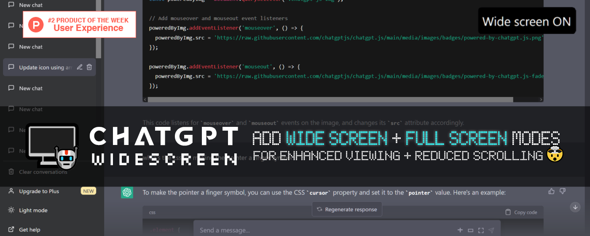

  
 

 
[Discuss](https://chatgptwidescreen.com/discuss) / 
[Review](https://microsoftedge.microsoft.com/addons/detail/chatgpt-widescreen-mode/obnaaalnokmchdoagnhmllakaclaaooa) / 
[Contact author](https://github.com/adamlui)
  

## 💡 About

**ChatGPT Widescreen Mode** adds widescreen + fullscreen modes to ChatGPT, enhancing your chat sessions by reducing scrolling & creating a more immersive viewing experience.

## 📺 Demo

 

## 💊 Benefits

🧠 Experience clearer programming code display with proper indentation

📜 View multi-step instructions or long recipes on a single page for easier reference

🖥️ Enjoy original lyrics, poetry, essays, or compositions in a more visually pleasing format

⚙️ Customize features like larger chatbox & hidden header/footer for more spacious view

🌐 Works with: **chatgpt.com** + **poe.com**

## 🗨️ User feedback

## 🚀 Installation

1. Install [ChatGPT Widescreen Mode](https://edge.chatgptwidescreen.com) Edge add-on

2. Visit [chatgpt.com](https://chatgpt.com) or [poe.com](https://poe.com) & mode toggles are added to chatbar!

*NOTE: Since full-window mode hides the sidebar, press '+' to start new chats*

*Pro tip: For easier access to extension toggles, (1) click  in the browser's toolbar, (2) then  next to extension name.*

## ⚡ Dependencies

<h6>

 

<a href="https://chatgpt.js.org">
    <picture>
        <source type="image/png" media="(prefers-color-scheme: dark)" srcset="https://media.chatgptjs.org/images/logos/chatgpt.js/flat/white/logo600x62.png?main">
        
    </picture>
</a>
  

ChatGPT Widescreen Mode relies on code from the powerful [chatgpt.js](https://github.com/KudoAI/chatgpt.js) library 
 © 2023–2024 KudoAI & contributors under the MIT license.

</h6>

## 🌐 Compatibility

ChatGPT Widescreen Mode is also available as an [Chrome add-on](https://chrome.chatgptwidescreen.com) and a [Greasemonkey userscript](https://greasyfork.chatgptwidescreen.com) (via [Tampermonkey](https://www.tampermonkey.net/).

The userscript is compatible w/ the following browsers:

- [Google Chrome](https://www.chrome.com)
- [Mozilla Firefox](https://www.firefox.com)
- [Microsoft Edge](https://www.microsoft.com/edge)
- [Opera](https://www.opera.com)
- [Brave](https://brave.com)
- [Vivaldi](https://vivaldi.com)
- [LibreWolf](https://librewolf.net/)
- [Ghost](https://ghostbrowser.com/)
- [QQ](https://browser.qq.com/)

 

<a href="https://edge.chatgptwidescreen.com">
 
[Discuss](https://chatgptwidescreen.com/discuss) / 
[Review](https://microsoftedge.microsoft.com/addons/detail/chatgpt-widescreen-mode/obnaaalnokmchdoagnhmllakaclaaooa) / 
[More ChatGPT add-ons](https://github.com/adamlui/chatgpt-addons)

## 🧠 Contributors

This extension exists thanks to code, translations, issues & ideas from the following contributors:

 

<a href="https://greasyfork.org/users/1210535-%E5%A4%A7%E8%81%AA%E6%98%8E-h4ha"><picture><source media="(prefers-color-scheme: dark)" srcset="https://media.chatgptwidescreen.com/images/icons/web-stores/greasy-fork/white/icon50.png"></picture></a>

<a href="https://greasyfork.org/users/1220444-some-guy-9283"><picture><source media="(prefers-color-scheme: dark)" srcset="https://media.chatgptwidescreen.com/images/icons/web-stores/greasy-fork/white/icon50.png"></picture></a>
<a href="https://greasyfork.org/users/1182535-jianmin-liang"><picture><source media="(prefers-color-scheme: dark)" srcset="https://media.chatgptwidescreen.com/images/icons/web-stores/greasy-fork/white/icon50.png"></picture></a>

<a href="https://greasyfork.org/users/1296464-brian-fennell"><picture><source media="(prefers-color-scheme: dark)" srcset="https://media.chatgptwidescreen.com/images/icons/web-stores/greasy-fork/white/icon50.png"></picture></a>
<a href="https://greasyfork.org/users/1009954-syz0528"><picture><source media="(prefers-color-scheme: dark)" srcset="https://media.chatgptwidescreen.com/images/icons/web-stores/greasy-fork/white/icon50.png"></picture></a>

<a href="https://chatgpt.com"><picture><source media="(prefers-color-scheme: dark)" srcset="https://images.weserv.nl/?url=https://media.chatgptwidescreen.com/images/icons/platforms/chatgpt/black-on-white/icon50.png?h=50&w=50&mask=circle&maxage=7d"></picture></a>

 

## 🤖 More ChatGPT apps

For even more epic ChatGPT apps, visit: https://github.com/adamlui/chatgpt-apps
  

## 📜 Related apps

### <picture><source media="(prefers-color-scheme: dark)" srcset="https://media.chatgptautorefresh.com/images/icons/openai/white/icon16.png"></picture> [ChatGPT Auto Refresh ↻](https://chatgptautorefresh.com) &nbsp;
> Keeps ChatGPT sessions fresh, eliminating chat time limits + network errors + Cloudflare checks.
 [Install](https://docs.chatgptautorefresh.com/#-installation) /
[Readme](https://docs.chatgptautorefresh.com/#readme) /
[Discuss](https://github.chatgptautorefresh.com/discussions)

###  [BraveGPT](https://bravegpt.com) &nbsp;
> Display ChatGPT answers in Brave Search sidebar.
 [Install](https://docs.bravegpt.com/#-installation) /
[Readme](https://docs.bravegpt.com/#readme) /
[Discuss](https://github.bravegpt.com/discussions)

### <picture><source media="(prefers-color-scheme: dark)" srcset="https://media.chatgptinfinity.com/images/icons/openai/white/icon16.png"></picture> [ChatGPT Infinity ∞](https://chatgptinfinity.com) &nbsp;
> Generate endless answers from all-knowing ChatGPT (in any language!)
 [Install](https://docs.chatgptinfinity.com/#-installation) /
[Readme](https://docs.chatgptinfinity.com/#-readme) /
[Discuss](https://github.chatgptinfinity.com/discussions)

<a href="https://github.com/adamlui/chatgpt-apps">**More ChatGPT add-ons**</a> /
<a href="https://github.chatgptwidescreen.com#readme">Back to top ↑</a>
